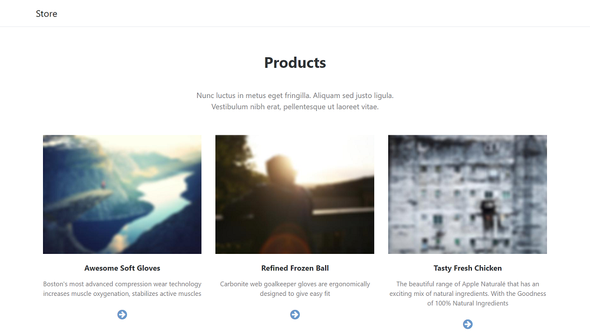
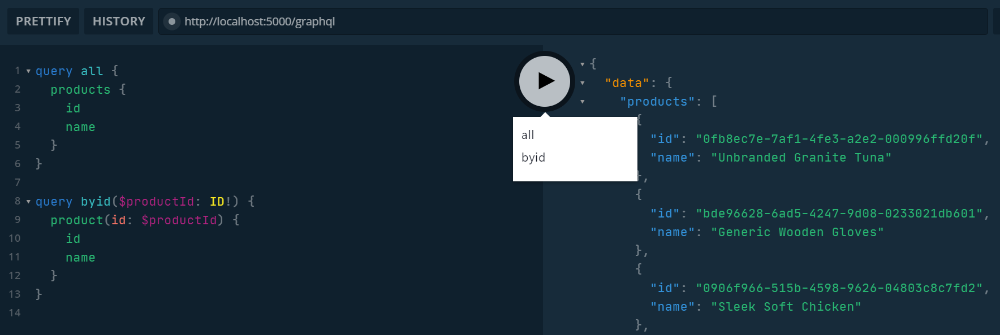

# Dotnet5.GraphQL3.WebApplication

This project exemplify the implementation and **Dockerization** of a simple Razor Web MVC Core consuming an full **GraphQL 3** Web API, build in a **.NET 5** multi-layer project, considering development best practices, like **SOLID** and **DRY**, applying **Domain-Driven** concepts in a **Hexagonal Architecture**.

CI  


Security/Quality   

[](https://www.codacy.com/gh/AntonioFalcao/Dotnet5.GraphQL3.WebApplication/dashboard?utm_source=github.com&amp;utm_medium=referral&amp;utm_content=AntonioFalcao/Dotnet5.GraphQL3.WebApplication&amp;utm_campaign=Badge_Grade)
___



---

## Environment configuration

### Development

##### Secrets

To configure database resource, `init` secrets in [`./src/Dotnet5.GraphQL3.Store.WebAPI`](./src/Dotnet5.GraphQL3.Store.WebAPI), and then define the `DefaultConnection`: 

```bash
dotnet user-secrets init
dotnet user-secrets set "ConnectionStrings:DefaultConnection" "Server=localhost,1433;Database=Store;User=sa;Password=!MyComplexPassword"
```

After this, to configure the HTTP client, `init` secrets in [`./src/Dotnet5.GraphQL3.Store.WebMVC`](./src/Dotnet5.GraphQL3.Store.WebMVC) and define **Store** client host:

```bash
dotnet user-secrets init
dotnet user-secrets set "HttpClient:Store" "http://localhost:5000/graphql"
```

##### AppSettings 

If you prefer, is possible to define it on WebAPI [`appsettings.Development.json`](./src/Dotnet5.GraphQL3.Store.WebAPI/appsettings.Development.json) and WebMVC [`appsettings.Development.json`](./src/Dotnet5.GraphQL3.Store.WebMVC/appsettings.Development.json) files:

WebAPI

```json5
{
  "ConnectionStrings": {
    "DefaultConnection": "Server=localhost,1433;Database=Store;User=sa;Password=!MyComplexPassword"
  }
}
```

WebMCV

```json5
{
  "HttpClient": {
    "Store": "http://localhost:5000/graphql"
  }
}
```
___

### Production

Considering use Docker for CD (Continuous Deployment). On respective [compose](./docker-compose.yml) both web applications and sql server are in the same network, and then we can use named hosts. Already defined on WebAPI [`appsettings.json`](./src/Dotnet5.GraphQL3.Store.WebAPI/appsettings.json) and WebMVC [`appsettings.json`](./src/Dotnet5.GraphQL3.Store.WebMVC/appsettings.json) files:   

##### AppSettings 

WebAPI

```json5
{
  "ConnectionStrings": {
    "DefaultConnection": "Server=mssql;Database=Store;User=sa;Password=!MyComplexPassword"
  }
}
```

WebMCV

```json5
{
  "HttpClient": {
    "Store": "http://webapi:5000/graphql"
  }
}
```
___

## Highlights

### Notifications (pattern/context)

To avoid handle exceptions, was implemented a [`NotificationContext`](./src/Dotnet5.GraphQL3.CrossCutting/Notifications/NotificationContext.cs) that's allow  all layers add business notifications through the request, with support to receive **Domain** notifications, that by other side, implementing validators from **Fluent Validation** and return a `ValidationResult`. 

```c#
protected bool OnValidate<TEntity>(TEntity entity, AbstractValidator<TEntity> validator)
{
    ValidationResult = validator.Validate(entity);
    return IsValid;
}

protected void AddError(string errorMessage, ValidationResult validationResult = default)
{
    ValidationResult.Errors.Add(new ValidationFailure(default, errorMessage));
    validationResult?.Errors.ToList().ForEach(failure => ValidationResult.Errors.Add(failure));
}
```

To the **GraphQL** the notification context delivery a `ExecutionErrors` that is propagated to `result` from execution by a personalised [`Executer`](./src/Dotnet5.GraphQL3.Store.WebAPI/GraphQL/Executers/StoreExecuter.cs):  

```c#
var result = await base.ExecuteAsync(operationName, query, variables, context, cancellationToken);
var notificationContext = _serviceProvider.GetRequiredService<INotificationContext>();

if (notificationContext.HasNotifications)
{
    result.Errors = notificationContext.ExecutionErrors;
    result.Data = default;
}
```

### Resolving `Scoped` dependencies with `Singleton` Schema.

Is necessary, in the same personalised [`Executer`](./src/Dotnet5.GraphQL3.Store.WebAPI/GraphQL/Executers/StoreExecuter.cs) define the _service provider_ that will be used from `resolvers` on `fields`:

```c#
var options = base.GetOptions(operationName, query, variables, context, cancellationToken);
options.RequestServices = _serviceProvider;
```

### Abstractions

With abstract designs, it is possible to reduce coupling in addition to applying **DRY** concepts, providing resources for the main behaviors:

[`...Domain.Abstractions`](./src/Dotnet5.GraphQL3.Domain.Abstractions)

```c#
public abstract class Entity<TId>
    where TId : struct
```

```c#
public abstract class Builder<TBuilder, TEntity, TId> : IBuilder<TEntity, TId>
    where TBuilder : Builder<TBuilder, TEntity, TId>
    where TEntity : Entity<TId>
    where TId : struct
```
    
[`...Repositories.Abstractions`](./src/Dotnet5.GraphQL3.Repositories.Abstractions/Repository.cs)  

```c#
public abstract class Repository<TEntity, TId> : IRepository<TEntity, TId>
    where TEntity : Entity<TId>
    where TId : struct
{
    private readonly DbSet<TEntity> _dbSet;

    protected Repository(DbContext dbDbContext)
    {
        _dbSet = dbDbContext.Set<TEntity>();
    }
```

[`...Services.Abstractions`](./src/Dotnet5.GraphQL3.Services.Abstractions/Service.cs) 

```c#
public abstract class Service<TEntity, TModel, TId> : IService<TEntity, TModel, TId>
    where TEntity : Entity<TId>
    where TModel : Model<TId>
    where TId : struct
{
    protected readonly IMapper Mapper;
    protected readonly INotificationContext NotificationContext;
    protected readonly IRepository<TEntity, TId> Repository;
    protected readonly IUnitOfWork UnitOfWork;

    protected Service(
        IUnitOfWork unitOfWork,
        IRepository<TEntity, TId> repository,
        IMapper mapper,
        INotificationContext notificationContext)
    {
        UnitOfWork = unitOfWork;
        Repository = repository;
        Mapper = mapper;
        NotificationContext = notificationContext;
    }
```

```c#
public abstract class MessageService<TMessage, TModel, TId> : IMessageService<TMessage, TModel, TId>
    where TMessage : class
    where TModel : Model<TId>
    where TId : struct
{
    private readonly IMapper _mapper;
    private readonly ISubject<TMessage> _subject;

    protected MessageService(IMapper mapper, ISubject<TMessage> subject)
    {
        _mapper = mapper;
        _subject = subject;
    }
```

### From `EF TPH` to `GraphQL Interface`

ENTITY

```c#
public class ProductConfig : IEntityTypeConfiguration<Product>
{
    public void Configure(EntityTypeBuilder<Product> builder)
    {
        builder
            .HasDiscriminator()
            .HasValue<Boot>(nameof(Boot))
            .HasValue<Kayak>(nameof(Kayak))
            .HasValue<Backpack>(nameof(Backpack));
    }
}
```

INHERITOR

```c#
public class KayakConfig : IEntityTypeConfiguration<Kayak>
{
    public void Configure(EntityTypeBuilder<Kayak> builder)
    {
        builder
            .HasBaseType<Product>();
    }
}
```

INTERFACE 

```c#
public sealed class ProductInterfaceGraphType : InterfaceGraphType<Product>
{
    public ProductInterfaceGraphType(BootGraphType bootGraphType, BackpackGraphType backpackGraphType, KayakGraphType kayakGraphType)
    {
        Name = "product";

        ResolveType = @object =>
        {
            return @object switch
            {
                Boot _ => bootGraphType,
                Backpack _ => backpackGraphType,
                Kayak _ => kayakGraphType,
                _ => default
            };
        };
    }
}
```

OBJECT

```c#
public sealed class KayakGraphType : ObjectGraphType<Kayak>
{
    public KayakGraphType()
    {
        Name = "kayak";
        Interface<ProductInterfaceGraphType>();
        IsTypeOf = o => o is Product;
    }
}
```

___

## Running

The [`./docker-compose.yml`](./docker-compose.yml) provide the `WebAPI`, `WebMVC` and `MS SQL Server` applications:

```bash
docker-compose up -d
``` 

## GraphQL Playground 

By default **Playground** respond at `http://localhost:5000/ui/playground` but is possible configure the host and many others details in [`../...WebAPI/GraphQL/DependencyInjection/Configure.cs`](./src/Dotnet5.GraphQL3.Store.WebAPI/GraphQL/DependencyInjection/Configure.cs)

```c#
app.UseGraphQLPlayground(
    new GraphQLPlaygroundOptions
    {
        Path = "/ui/playground",
        BetaUpdates = true,
        RequestCredentials = RequestCredentials.Omit,
        HideTracingResponse = false,

        EditorCursorShape = EditorCursorShape.Line,
        EditorTheme = EditorTheme.Dark,
        EditorFontSize = 14,
        EditorReuseHeaders = true,
        EditorFontFamily = "JetBrains Mono"
    });
```

## Queries

#### Fragment for comparison and Arguments

QUERY

```markdown
{
  First: product(id: "2c05b59b-8fb3-4cba-8698-01d55a0284e5") {
    ...comparisonFields
  }
  Second: product(id: "65af82e8-27f6-44f3-af4a-029b73f14530") {
    ...comparisonFields
  }
}

fragment comparisonFields on Product {
  id
  name
  rating
  description
}
```

RESULT

```json5
{
  "data": {
    "First": {
      "id": "2c05b59b-8fb3-4cba-8698-01d55a0284e5",
      "name": "libero",
      "rating": 5,
      "description": "Deleniti voluptas quidem accusamus est debitis quisquam enim."
    },
    "Second": {
      "id": "65af82e8-27f6-44f3-af4a-029b73f14530",
      "name": "debitis",
      "rating": 10,
      "description": "Est veniam unde."
    }
  }
}
```
___
#### Query named's and Variables


QUERY

```markdown
query all {
  products {
    id
    name
  }
}

query byid($productId: ID!) {
  product(id: $productId) {
    id
    name
  }
}
```

VARIABLES

```json5
{
  "productId": "2c05b59b-8fb3-4cba-8698-01d55a0284e5"
}
```

HTTP BODY

```markdown
{
    "operationName": "byid",
    "variables": {
        "productId": "2c05b59b-8fb3-4cba-8698-01d55a0284e5"
    },
    "query": "query all {
        products {
          id
          name
        }
    }
    query byid($productId: ID!) {
        product(id: $productId) {
          id
          name
        }
    }"
}
```

PLAYGROUND

 
___
#### Variables with include, skip and default value

QUERY

```markdown
query all($showPrice: Boolean = false) {
  products {
    id
    name
    price @include(if: $showPrice)
    rating @skip(if: $showPrice)
  }
}
```

VARIABLES

```json5
{
  "showPrice": true
}
```

HTTP BODY

```markdown
{
    "operationName": "all",
    "variables": {
        "showPrice": false
    },
    "query": "query all($showPrice: Boolean = false) {
          products {
            id
            name
            price @include(if: $showPrice)
            rating @skip(if: $showPrice)
          }
    }"
}
```
___

## Mutations

MUTATION

> Creating / adding a new Review to the respective product.

```markdown
mutation($review: reviewInput!) {
  createReview(review: $review) {
    id
  }
}
```
VARIABLES

```json5
{
  "review": {
    "title": "some title",
    "comment": "some comment",
    "productId": "0fb8ec7e-7af1-4fe3-a2e2-000996ffd20f"
  }
}
```

RESULT

```json5
{
  "data": {
    "createReview": {
      "title": "some title"
    }
  }
}
```
___

## Subscriptions

SUBSCRIPTION

> The Mutation stay listening if a new review is added.

```markdown
subscription {
  reviewAdded {
    title
  }
}

```
RESULT

```json5
{
  "data": {
    "reviewAdded": {
      "title": "Some title"
    }
  }
}
```
___

## Built With

### Microsoft Stack - v5.0 (RC 1)

* [.NET 5.0](https://dotnet.microsoft.com/) - Base framework;
* [ASP.NET 5.0](https://docs.microsoft.com/en-us/aspnet/core/?view=aspnetcore-3.1) - Web framework;
* [Entity Framework Core 5.0](https://docs.microsoft.com/en-us/ef/core/what-is-new/ef-core-5.0/plan) - ORM;
* [Microsoft SQL Server on Linux for Docker](https://docs.microsoft.com/en-us/ef/core/what-is-new/ef-core-5.0/plan) - Database.

### GraphQL Stack - v3.0 (preview/alpha)

* [GraphQL](https://graphql.org/) - GraphQL is a query language for APIs and a runtime for fulfilling those queries with data;
* [GraphQL for .NET](https://github.com/graphql-dotnet/graphql-dotnet/) - This is an implementation of GraphQL in .NET;
* [GraphQL.Client](https://github.com/graphql-dotnet/graphql-client) - A GraphQL Client for .NET over HTTP;
* [GraphQL Playground](https://github.com/prisma-labs/graphql-playground/) - GraphQL IDE for better development workflows.

### Community Stack

* [AutoMapper](https://automapper.org/) - A convention-based object-object mapper;
* [FluentValidation](https://fluentvalidation.net/) - A popular .NET library for building strongly-typed validation rules;
* [Bogus](https://github.com/bchavez/Bogus) - A simple and sane fake data generator for C#, F#, and VB.NET;
* [Bootstrap](https://getbootstrap.com/) - The most popular HTML, CSS, and JS library in the world.

## Contributing

Available soon!

## Versioning

We use [SemVer](http://semver.org/) for versioning. For the versions available, see the [tags on this repository](https://github.com/AntonioFalcao/Dotnet5.GraphQL.WebApplication/tags).

## Authors

* **Antônio Falcão** - [GitHub](https://github.com/AntonioFalcao)

> See also the list of [contributors](https://github.com/AntonioFalcao/Dotnet5.GraphQL.WebApplication/graphs/contributors) who participated in this project.

## License

This project is licensed under the MIT License - see the [LICENSE](./LICENSE) file for details

## Acknowledgments

* Nothing more, for now.
